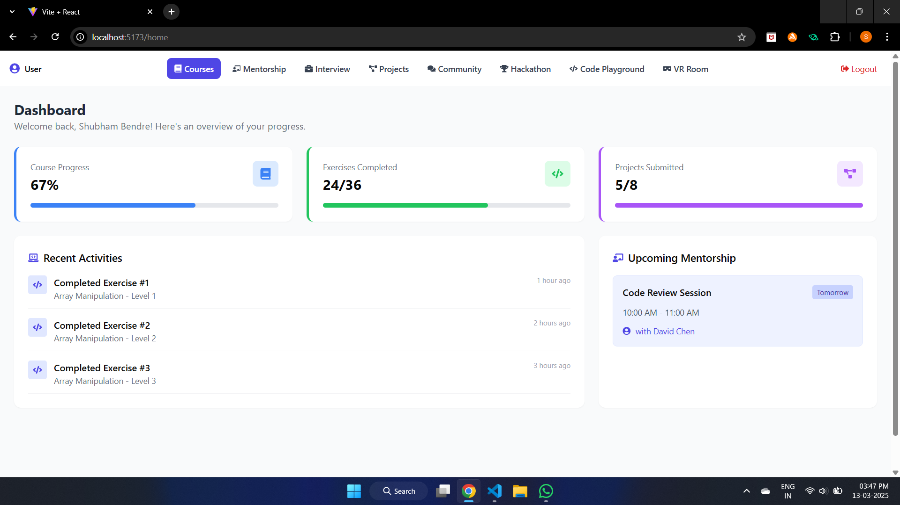
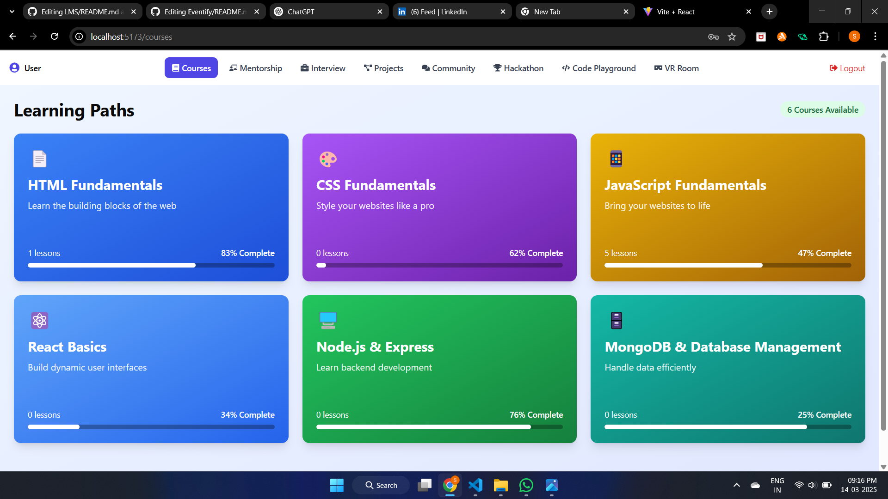
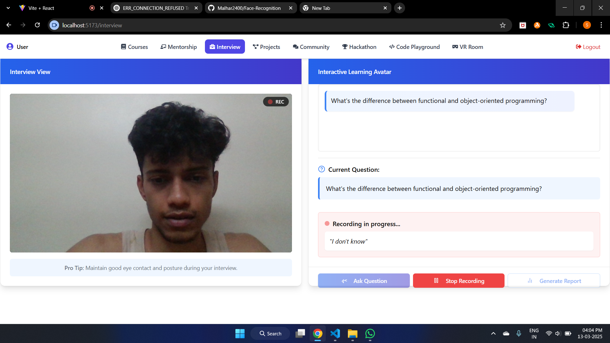
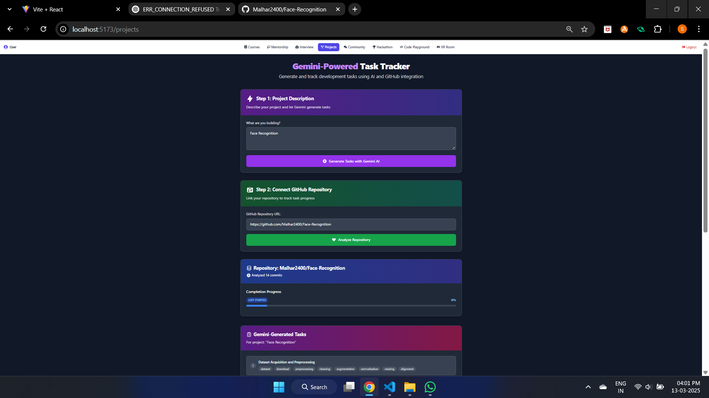
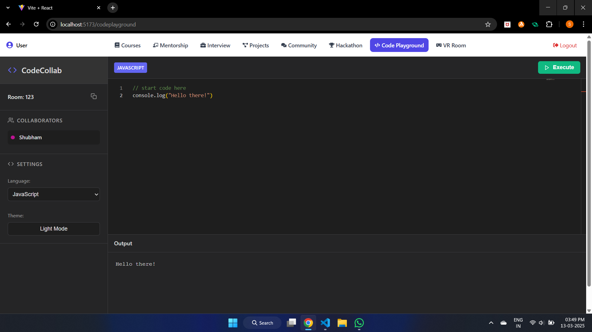
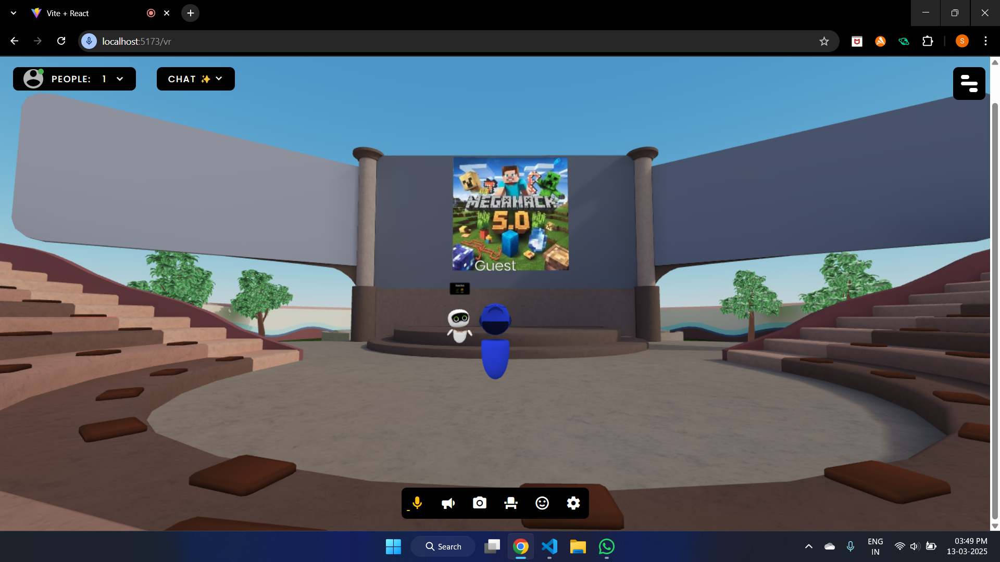
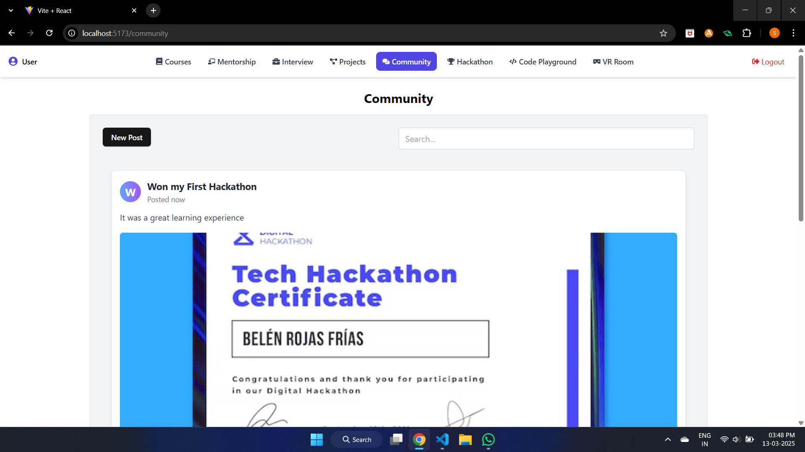
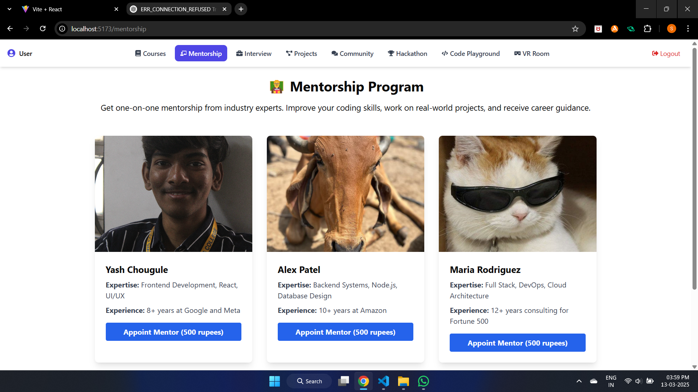

# 📚 Full Stack LMS – The Ultimate Learning Hub for Developers  

🚀 **A modern Learning Management System designed to help aspiring full-stack developers learn, practice, and grow.** 🚀  

Full Stack LMS is a **MERN stack** application that provides structured learning modules, interactive quizzes, AI-powered interview preparation, real-time collaboration, and a VR-driven community experience.  

---

## 🌟 Features  

- **Comprehensive Learning Modules** 📖  
  Structured full-stack courses with quizzes and assessments.  

- **AI-Powered Interview Preparation** 🎙️🤖  
  AI voice asks interview questions while evaluating facial expressions and verbal responses.  

- **1:1 Mentorship** 🧑‍🏫  
  Users can book personalized mentoring sessions with industry experts.  

- **Project-Based Learning** 💻  
  Choose a project (e.g., Tic-Tac-Toe), receive step-by-step guidance, and track progress by uploading your repository.  

- **Live Code Playground** ⌨️💬  
  Real-time coding collaboration and compilation with other users.  

- **Community & Hackathons** 👥🏆  
  Engage in discussions, participate in hackathons, and share knowledge.  

- **VR Room for Workshops & Meetups** 🕶️  
  Virtual meetups and interactive coding workshops in a VR environment.  

---

## 🛠️ Tech Stack  

- **Frontend:** React, Tailwind CSS, ShadCN  
- **Backend:** Node.js, Express.js  
- **Database:** MongoDB  

---

## 📋 Key Functionalities  

1. **Full-Stack Learning Modules** – Interactive courses with quizzes and coding challenges.  
2. **AI-Driven Interview Prep** – Evaluate responses using voice analysis & facial expression tracking.  
3. **Mentorship Program** – Book 1:1 sessions with experienced developers.  
4. **Project Learning & Tracking** – Step-by-step guidance for building projects with progress tracking.  
5. **Live Coding Playground** – Real-time code execution and collaboration with other learners.  
6. **Hackathons & Community Engagement** – Join coding events and interact with peers.  
7. **VR-Enabled Workshops** – Attend virtual meetups and live coding sessions in an immersive environment.  

---

## 📸 Screenshots  

### 1️⃣ Dashboard  
  

### 2️⃣ Learning Module  
  

### 3️⃣ AI Interview Prep  
  

### 4️⃣ Project Tracking  
  

### 5️⃣ Code Playground  
  

### 6️⃣ VR Workshop Room  
  

### 7️⃣ Community

### 8️⃣ Mentorship  
 

### 9️⃣ Hackthon 
  

---

## 📜 **Credits**  
- **Developers**: [@Shubham_Bendre](https://github.com/Shubham-Bendre), [@Malhar_Singh](https://github.com/Malhar2400), [@Yash_Chougule](https://github.com/YxASH)  
- **Inspiration**: Interactive coding platforms like W3Schools, LeetCode, and Udemy  

---

